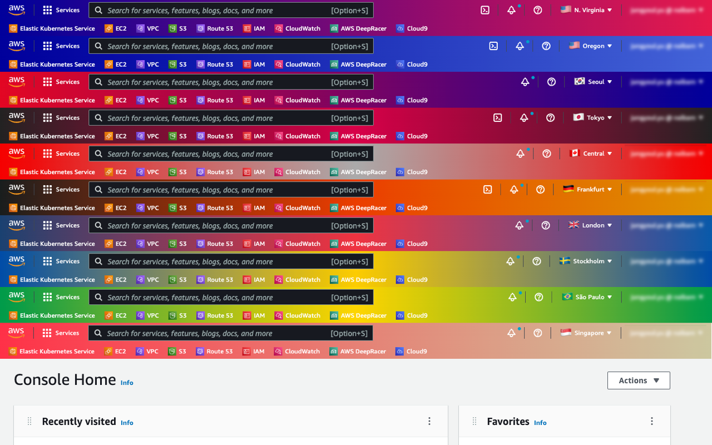
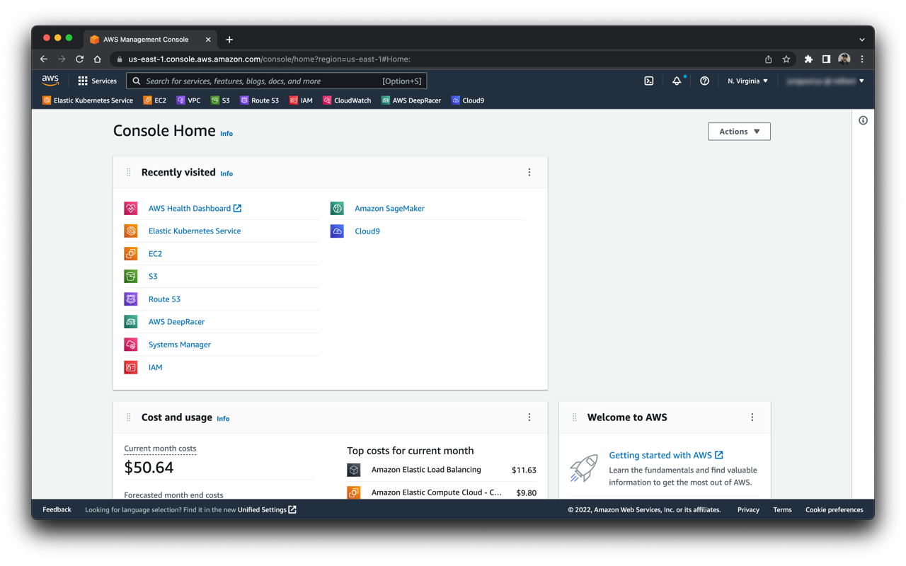
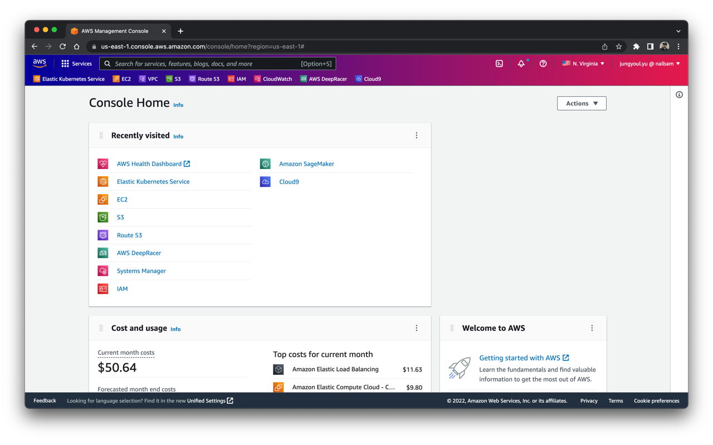

# aws-navbar-extension

> Change navbar color and flag according to AWS region

## Install

* [Chrome Web Store](https://chrome.google.com/webstore/detail/aws-colorful-navbar/kgifmgnlchjjippdpkblbdlfidcpceme)
* [Microsoft Edge](https://chrome.google.com/webstore/detail/aws-colorful-navbar/kgifmgnlchjjippdpkblbdlfidcpceme)
* Mozilla Firefox (Manually)
  * Open `about:config` menu in Firefox
  * Change value to `xpinstall.signatures.required = false`
  * Check temporary addon extension id in browser
  * Add extension id to manifest.json
    ```
    "applications": {
      "gecko": {
        "id": "000000000@temporary-addon"
      }
    }
    ```
  * Create .xpi file
    ```
    cd <extension-folders>
    7z a ../<extension-name>.xpi * -r
    ```
  * Install this .xpi file in `about:addons` menu

## How to load

* Open the Extension Management page by navigating to `chrome://extensions`
* Enable `Developer Mode` by clicking the toggle switch
* Click the `LOAD UNPACKED` button and select the extension directory

## Screenshots






